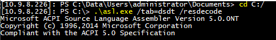
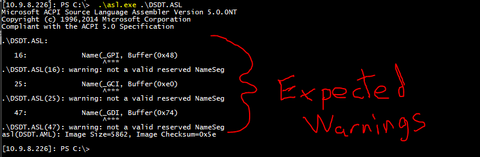
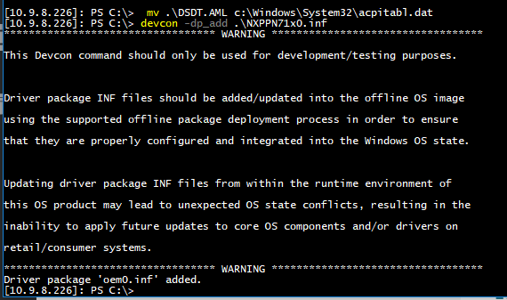
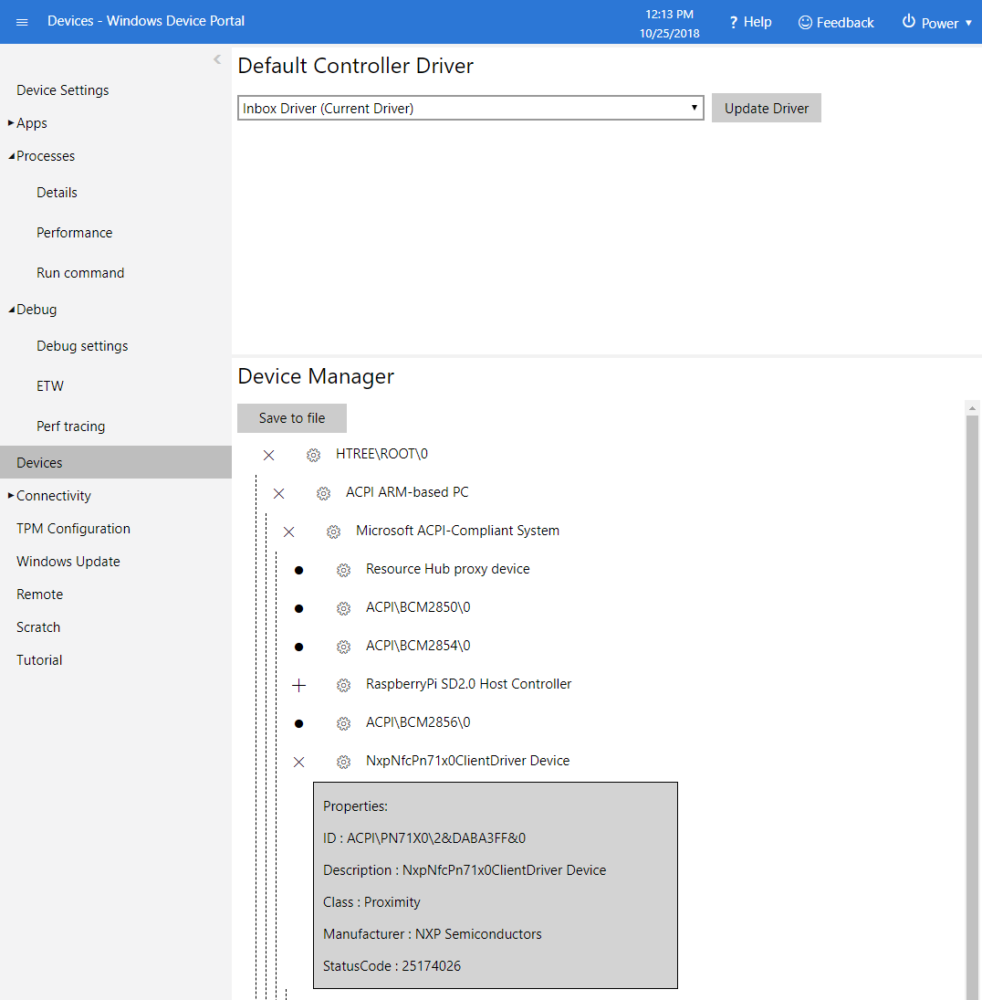

# Edutainment Station for Raspberry Pi 3 Model B

## PN7150 Driver Installation Instructions

1. Browse to `\\{PI.IP.Address}\c$
2. Copy `./asl.exe` to the Raspberry Pi.
3. Run `.\asl.exe /tab=dsdt /resdecode`  Expected output below:

4. Copy the contents of `./acpitable_pn71xx.txt` into `DSDT.ASL`.  See [this commit](https://github.com/estenrye/edutainment-station/commit/ecb31bacdef8345a7e23de7c088593d786a32a29) for an example of where to insert the code.
5. Run `.\asl.exe .\DSDT.ASL` to build a new ACPI table based on the updated `DSDT.ASL` file. The following Warnings are expected:

6. Move the generated DSDT.AML file and rename as acpitabl.dat to the C:\Windows\System32 folder using the following command: `mv .\DSDT.AML c:\Windows\System32\acpitabl.dat`
7. Copy `./NXPPN71x0.inf` to the Raspberry Pi.
8. Run `devcon -dp_add .\NXPPN71x0.inf` to install the driver.  The following output is expected:

9. Reboot the Raspberry Pi.
10. Verify successful installation in the IOT Device Portal.

For additional information, please see the [AN11767 NXP Application Note](https://www.nxp.com/docs/en/application-note/AN11767.pdf)