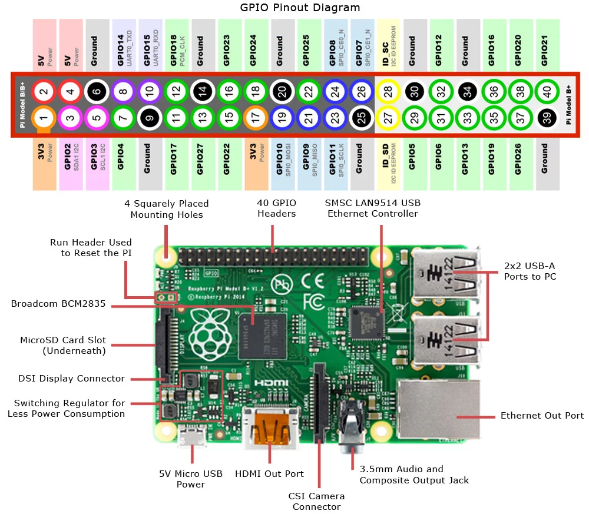

# Edutainment Station for Raspberry Pi 3 Model B

## Hardware Components
- [Raspberry Pi 3 Model B v1.2](https://www.adafruit.com/product/3055)
- [NXP PN7150 NFC Controller SBC Kit for Raspberry Pi](https://www.nxp.com/products/identification-and-security/nfc/nfc-reader-ics/development-kits-for-pn7150-plugn-play-nfc-controller:OM5578)

## Requirements

| Name | Edutainment Station |
| ---- | ------------------- |
| Purpose | |
| Inputs | |
| Outputs | |
| Functions | |
| Performance | |
| Manufacturing Cost | |
| Power | |
| Physical Size and Weight | |

## Specification

## System Architecture

## Component Design and Testing

## System Integration and Testing

## Block Diagrams

### Raspberry Pi 3 Block Diagram and IO Map

[(shabaz, 2017)](https://www.element14.com/community/community/raspberry-pi/blog/2017/01/16/raspberry-pi-3-block-diagram)

[(Jameco Electronics, )](https://www.jameco.com/Jameco/workshop/circuitnotes/raspberry-pi-circuit-note.html)

### NXP PN7150 Block Diagram

[(DigiKey, 2016)](https://www.digikey.com/en/product-highlight/n/nxp-semi/pn7150-plug-n-play?utm_adgroup=General&slid=&gclid=Cj0KCQjw6rXeBRD3ARIsAD9ni9B7nDjbrQYIem_JmXNQUI-djQaeZzJiTdwNge0e3Wtz6qj8bwgBioQaAozsEALw_wcB)

## References

- DigiKey. (2016). [Product highlights:&nbsp;PN7150 plug-and-play NFC controller.](https://www.digikey.com/en/product-highlight/n/nxp-semi/pn7150-plug-n-play?utm_adgroup=General&slid=&gclid=Cj0KCQjw6rXeBRD3ARIsAD9ni9B7nDjbrQYIem_JmXNQUI-djQaeZzJiTdwNge0e3Wtz6qj8bwgBioQaAozsEALw_wcB)
- Jameco [Electronics.Raspberry pi pinout diagram | circuit notes.](https://www.jameco.com/Jameco/workshop/circuitnotes/raspberry-pi-circuit-note.html)
- shabaz. (2017). [Raspberry Pi 3 Block Diagram.](https://www.element14.com/community/community/raspberry-pi/blog/2017/01/16/raspberry-pi-3-block-diagram)