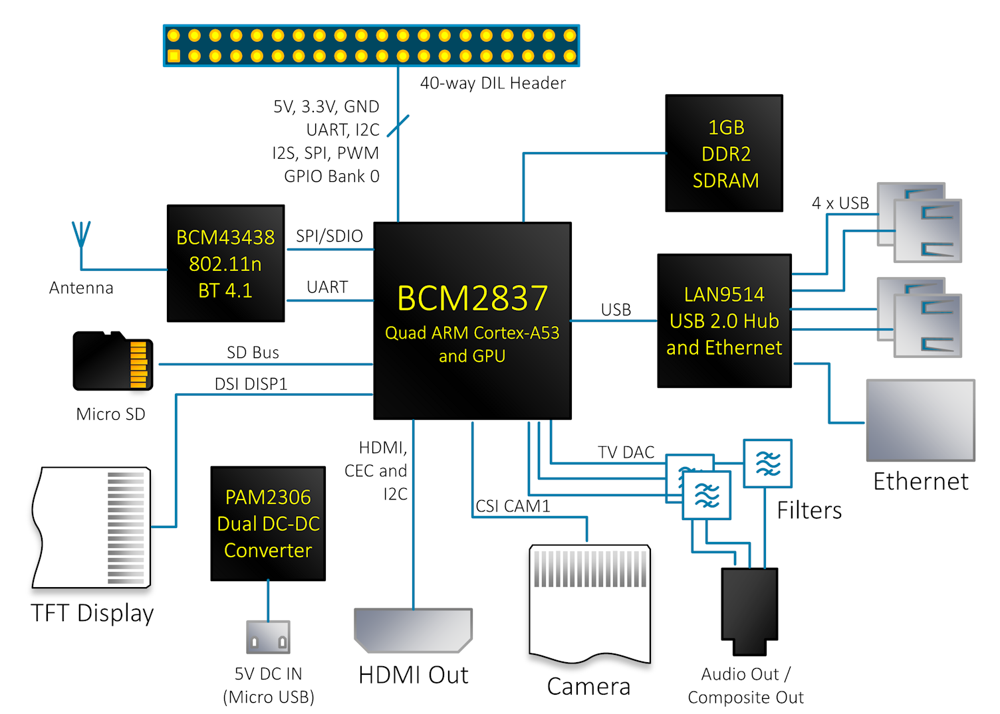
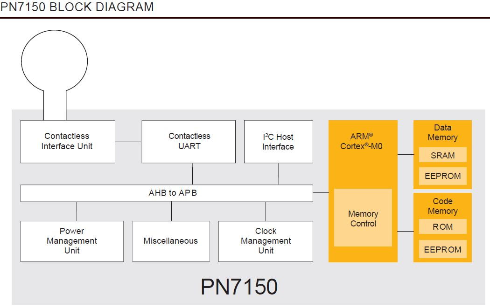

# Edutainment Station for Raspberry Pi 3 Model B

## Hardware Components
- [Raspberry Pi 3 Model B v1.2](https://www.adafruit.com/product/3055)
- [NXP PN7150 NFC Controller SBC Kit for Raspberry Pi](https://www.nxp.com/products/identification-and-security/nfc/nfc-reader-ics/development-kits-for-pn7150-plugn-play-nfc-controller:OM5578)

## Requirements

| Name | Edutainment Station |
| ---- | ------------------- |
| **Purpose** | An expandable entertainment/education platform used to teach my daughter primary and secondary colors through an interactive display triggered by physical objects tagged with RFID tags. |
| **Inputs** | Seven RFID Cards, each representing a different color (Red, Blue, Yellow, Green, Purple, Orange, Rainbow) |
| **Outputs** | One 7" Touchscreen Display that displays the name of the color with that color as its background; One Buzzer that indicates whether a RFID tag has been read. |
| **Functions** | Default Mode: The edutainment station will display the animation for the last scanned tag.  If no tag has been scanned, the edutainment station will default to the rainbow animation. |
| | When a RFID tag is brought in proximity of the RFID reader, the edutainment station will sound a single beep on the Buzzer to indicate the RFID tag has been read. |
| | When a RFID tag is brought in proximity of the RFID reader, the edutainment station will select and display an animation for the scanned tag. |
| | When the Touchscreen on the edutainment station is touched, the animation will toggle between any avaialbe secondary animations and the main animation. |
| **Performance** | The target user for the system is a toddler, so typical human factors constraints apply to ensure the toddler maintains interest.  Buzzer should sound within 100 ms of the RFID tag having been read; Touchscreen display should display screen output within 100 ms of the RFID tag having been read;  Input from the touchscreen display, if used, should notify the user input has been received within 100 ms. |
| **Manufacturing Cost** | The electronic components for this device should cost no more than $200 USD. |
| **Power** | The device should be able to run continuously for at least 30 minutes on battery power. The device should be able to run for at least 4 hours of moderate use on battery power. The device should be able to charge and run simultaneously when on AC power. |
| **Physical Size and Weight** | Small enough to embed into the top of a small desk sized appropriately to a toddler. |

## Specification

## System Architecture

## Component Design and Testing

## System Integration and Testing

## Block Diagrams

### Raspberry Pi 3 Block Diagram and IO Map

[(shabaz, 2017)](https://www.element14.com/community/community/raspberry-pi/blog/2017/01/16/raspberry-pi-3-block-diagram)

[(Jameco Electronics, )](https://www.jameco.com/Jameco/workshop/circuitnotes/raspberry-pi-circuit-note.html)

### NXP PN7150 Block Diagram

[(DigiKey, 2016)](https://www.digikey.com/en/product-highlight/n/nxp-semi/pn7150-plug-n-play?utm_adgroup=General&slid=&gclid=Cj0KCQjw6rXeBRD3ARIsAD9ni9B7nDjbrQYIem_JmXNQUI-djQaeZzJiTdwNge0e3Wtz6qj8bwgBioQaAozsEALw_wcB)

## References

- DigiKey. (2016). [Product highlights:&nbsp;PN7150 plug-and-play NFC controller.](https://www.digikey.com/en/product-highlight/n/nxp-semi/pn7150-plug-n-play?utm_adgroup=General&slid=&gclid=Cj0KCQjw6rXeBRD3ARIsAD9ni9B7nDjbrQYIem_JmXNQUI-djQaeZzJiTdwNge0e3Wtz6qj8bwgBioQaAozsEALw_wcB)
- Jameco [Electronics.Raspberry pi pinout diagram | circuit notes.](https://www.jameco.com/Jameco/workshop/circuitnotes/raspberry-pi-circuit-note.html)
- shabaz. (2017). [Raspberry Pi 3 Block Diagram.](https://www.element14.com/community/community/raspberry-pi/blog/2017/01/16/raspberry-pi-3-block-diagram)