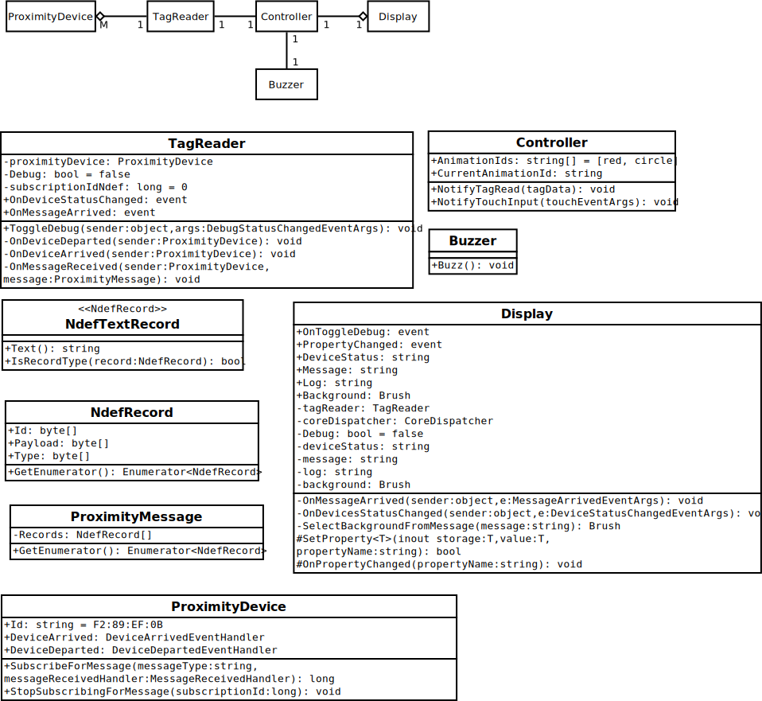

# Edutainment Station for Raspberry Pi 3 Model B

## Hardware Components
- 1 [Raspberry Pi 3 Model B v1.2](https://www.adafruit.com/product/3055)
- 1 [NXP PN7150 NFC Controller SBC Kit for Raspberry Pi](https://www.nxp.com/products/identification-and-security/nfc/nfc-reader-ics/development-kits-for-pn7150-plugn-play-nfc-controller:OM5578)
- 1 [Raspberry Pi 7" Touchscreen Display](https://www.amazon.com/gp/product/B0153R2A9I/ref=oh_aui_detailpage_o02_s00?ie=UTF8&psc=1)
- 7 [13.56 MHz RFID/NFC White Tag - 1 KB](https://www.adafruit.com/product/360)

## Software Packages

- [Etcher](https://etcher.io/)
- [Windows Driver Kit (WDK)](https://docs.microsoft.com/en-us/windows-hardware/drivers/download-the-wdk)

## Requirements

| Name | Edutainment Station |
| ---- | ------------------- |
| **Purpose** | An expandable entertainment/education platform used to teach my daughter primary and secondary colors through an interactive display triggered by physical objects tagged with NFC tags. |
| **Inputs** | Seven NFC Cards, each representing a different color (Red, Blue, Yellow, Green, Purple, Orange, Rainbow) |
| **Outputs** | One 7" Touchscreen Display that displays the name of the color with that color as its background; One Buzzer that indicates whether a NFC tag has been read. |
| **Functions** | Default Mode: The edutainment station will display the animation for the last scanned tag.  If no tag has been scanned, the edutainment station will default to the rainbow animation. |
| | When a NFC tag is brought in proximity of the NFC reader, the edutainment station will sound a single beep on the Buzzer to indicate the NFC tag has been read. |
| | When a NFC tag is brought in proximity of the NFC reader, the edutainment station will select and display an animation for the scanned tag. |
| | When the Touchscreen on the edutainment station is touched, the animation will toggle between any avaialbe secondary animations and the main animation. |
| **Performance** | The target user for the system is a toddler, so typical human factors constraints apply to ensure the toddler maintains interest.  Buzzer should sound within 100 ms of the NFC tag having been read; Touchscreen display should display screen output within 100 ms of the NFC tag having been read;  Input from the touchscreen display, if used, should notify the user input has been received within 100 ms. |
| **Manufacturing Cost** | The electronic components for this device should cost no more than $200 USD. |
| **Power** | The device should be able to run continuously for at least 30 minutes on battery power. The device should be able to run for at least 4 hours of moderate use on battery power. The device should be able to charge and run simultaneously when on AC power. |
| **Physical Size and Weight** | Small enough to embed into the top of a small desk sized appropriately to a toddler. |

## Specification

The Tag class represents the physical objects with embedded NFC tags.  These objects will have one or more `animationIds` transmitted to the TagReader class when the object reaches close enough proximity to the NFC Controller's antenna.  The TagReader class encapsulates the NFC Controller logic into a single interface class.  When the `OnTagAdded` event is triggered, `HandleTag` will read the data on the NFC tag and notify the `Controller` class the tag has been read using the `NotifyTagRead` method.  Upon notification of a NFC tag read, the `Controller` class activates the `Buzzer` using the `Buzz` method and updates the `Display` by passing the first `animationId` to the `UpdateDisplay` method.  If the user touches the display, the `Display` class will notify the `Controller` class using the `NotifyTouchInput` method.  The `Controller` class will determine the next `animationId` to send to the `Display` class using `UpdateDisplay`.  If only one `animationId` is available, it will be sent again.

## System Architecture

The system is driven by aperiodic inputs, NFC tag reads.  The NFC Tags can be served by an interrupt driven routine that will select and display the appropriate screen based on the Tag that has been read.  -

### Processor Evaluation

The following criteria were used to select the processor and platform to build this project.

| Criteria | Raspberry Pi 3 Model B | Raspberry Pi 3 Model B+ | MinnowBoard Turbot Quad-Core | Dragonboard 410c | AAEON Up Squared |
| --- | --- | --- | --- | --- | --- |
| Price | $35 | $35 | $189.95 | $75 | $149 |
| Actual Cost | $0 (development board available on-hand) | $35 | $189.95 | $75 | $149 |
| Main Processor | Broadcom BCM2837, ARM Cortex A53 | Broadcom BCM2837B0, ARM Cortex A53 | Quad-Core Intel® Atom™ E3845 | Qualcomm® Snapdragon™ 410, ARM Cortex A53 | Intel Celeron N3350 |
| Clock Speed | 1.2 GHz | 1.4 GHz | 1.91 GHz | 1.2 GHz | 2.4 GHz |
| Core Count | 4 | 4 | 4 | 4 | 2 |
| Volatile Memory | 1 GB | 1 GB | 2 GB | 1 GB | 2 GB |
| Non-Volatile Memory | 0 MB on chip.  SD Card Slot | 0 MB on chip.  SD Card Slot | 8 MB SPI Flash, mPcie/SATA/USB | 8 MB eMMC Flash, SD Card Slot | 32 GB eMMC Flash, SATA3 |
| Video Core Clock Speed | 400 MHz | 400 MHz | 542 MHz | 400 MHz | 200 MHz |
| Supports Windows IOT Core | Yes | Technical Preview | Yes | Yes | Yes |
| Graphics Connectivity | HDMI (Full), Display DSI Connector | HDMI (Full), Display DSI Connector | HDMI (Micro) | HDMI (Full) | HDMI, DisplayPort |
| Communication Standards | 100 Mbps Ethernet, 2.4 GHz 802.11 a/b/n, BLE | 300 Mbps Ethernet, 2.4 GHz/5 GHz 802.11 b/g/n/ac, BLE | 1 Gbps Ethernet | 2.4 GHz 802.11 b/g/n, BLE | Dual Gigabit Ethernet |
| GPIO Pins | 40 | 40 | 26 | 40 | 40 |
| Datasheets | [Raspberry Pi 3 Model B](https://www.adafruit.com/product/3055) | [Raspberry Pi 3 B+](https://static.raspberrypi.org/files/product-briefs/Raspberry-Pi-Model-Bplus-Product-Brief.pdf) | [MinnowBoard Turbot Quad-Core](https://minnowboard.org/minnowboard-turbot/technical-specs) [Intel Atom E38xx Data Sheet](https://www.intel.com/content/dam/www/public/us/en/documents/datasheets/atom-e3800-family-datasheet.pdf) | [DragonBoard 410c](https://developer.qualcomm.com/hardware/dragonboard-410c) [Qualcomm SnapDragon 410c datasheet](https://www.qualcomm.com/media/documents/files/snapdragon-410-processor-product-brief.pdf) [Adreno Wikipedia](https://en.wikipedia.org/wiki/Adreno) | [Datasheet](https://up-board.org/wp-content/uploads/datasheets/UP-Square-DatasheetV0.5.pdf) [UP Shop](https://up-shop.org/home/270-up-squared.html#/95-up_squared_board-celeron_duo_core_2gb_memory_32gb_emmc) [Intel Datasheet](https://ark.intel.com/products/95598/Intel-Celeron-Processor-N3350-2M-Cache-up-to-2-4-GHz-) |

The key selection criteria for the processer were the following:

| Criteria | Raspberry Pi 3 Model B | Raspberry Pi 3 Model B+ | MinnowBoard Turbot Quad-Core | Dragonboard 410c | AAEON Up Squared |
| --- | --- | --- | --- | --- | --- |
| Actual Cost              |  5 |  4 |  1 |  3 |  1 |
| Clock Speed              |  2 |  3 |  4 |  2 |  5 |
| Video Core Clock Speed   |  4 |  4 |  5 |  4 |  1 |
| Supports IOT Core        |  5 |  3 |  5 |  5 |  5 |
| Communications Standards |  5 |  5 |  1 |  3 |  1 |
| Total                    | 21 | 19 | 16 | 17 | 13 |

### A/D Converter and DAC Evaluation

| Criteria | NXP OM5577 | NXP PN532 |
| --- | --- | --- |
| Natively Supported by Windows IOT Core | Yes | No |
| Price | $27 | $39.95 |
| Actual Cost | $0 (Supplied by NXP) | $0 (Available on Hand) |
| PI HAT Form Factor | Yes | No |

## Component Design and Testing

## System Integration and Testing

## Block Diagrams

### Raspberry Pi 3 Block Diagram and IO Map

[(shabaz, 2017)](https://www.element14.com/community/community/raspberry-pi/blog/2017/01/16/raspberry-pi-3-block-diagram)

[(Jameco Electronics, )](https://www.jameco.com/Jameco/workshop/circuitnotes/raspberry-pi-circuit-note.html)

### NXP PN7150 Block Diagram

[NXP. (2018)](https://www.nxp.com/docs/en/data-sheet/PN7150.pdf)

## References

- DigiKey. (2016). [Product highlights:&nbsp;PN7150 plug-and-play NFC controller.](https://www.digikey.com/en/product-highlight/n/nxp-semi/pn7150-plug-n-play?utm_adgroup=General&slid=&gclid=Cj0KCQjw6rXeBRD3ARIsAD9ni9B7nDjbrQYIem_JmXNQUI-djQaeZzJiTdwNge0e3Wtz6qj8bwgBioQaAozsEALw_wcB)
- Jameco [Electronics.Raspberry pi pinout diagram | circuit notes.](https://www.jameco.com/Jameco/workshop/circuitnotes/raspberry-pi-circuit-note.html)
- NXP. (2017). [PN71x0 windows IoT porting guidelines.](https://www.nxp.com/docs/en/application-note/AN11767.pdf)
- NXP. (2018). [PN7150 Product Data Sheet.](https://www.nxp.com/docs/en/data-sheet/PN7150.pdf)
- shabaz. (2017). [Raspberry Pi 3 Block Diagram.](https://www.element14.com/community/community/raspberry-pi/blog/2017/01/16/raspberry-pi-3-block-diagram)